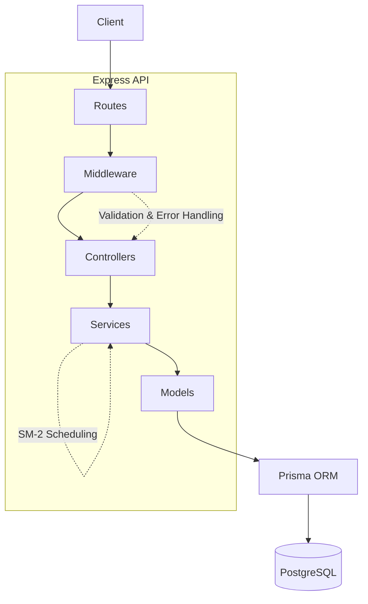

# Top Vino Backend

A spaced repetition learning/flashcard application backend built with Node.js, Express, TypeScript, and Prisma.

## 📚 Documentation

- [Project Review & Roadmap](./doc/PROJECT_REVIEW.md) - Complete overview of the project status and development roadmap
- [Phase 1: Error Handling](./doc/PHASE_1_ERROR_HANDLING.md) - Completed implementation details and acceptance criteria
<!-- - [Testing Guide](./doc/TESTING.md) - How to run tests and how the test database setup works -->
- [Phase 2 TDD PRD](./plans/phase-2-tdd-prd.md) - TDD-first execution plan for testing setup and core CRUD delivery

## 🚀 Quick Start

```bash
# Install dependencies
npm install

# Start development server with Docker
docker-compose up

# Or run locally (requires PostgreSQL)
npm run dev
```

## 📋 Current Status

**In Development - Phase 2 Delivered, Preparing Phase 3 (Auth)**

### Completed ✅

- User CRUD operations
- Deck CRUD operations
- Card CRUD operations
- Review submission, due-card queries, and progress retrieval
- SM-2 based review scheduling logic in review service
- Jest + Supertest automated test harness with unit and integration suites
- Centralized error handling with Prisma and validation support
- Database schema and migrations
- Docker development environment

### In Progress 🚧

- Refining review scheduling behavior (SM-2 interval tuning)
- Preparing authentication and authorization implementation (Phase 3)
- Keeping documentation aligned with current architecture and roadmap

### Next Up 📌

- Add `/auth/register` and `/auth/login` endpoints
- Add JWT auth middleware and route protection
- Replace query-based `userId` ownership checks with `req.user.id`

See [PROJECT_REVIEW.md](./doc/PROJECT_REVIEW.md) for detailed roadmap.

## 🏗️ Backend Architecture (Current)



### Project structure
``` ascii
src/
├── routes/
├── controllers/
├── services/
├── models/
├── middleware/
├── utils/
└── prisma/
```

``` ascii
Roadmap

Authentication
      │
      ▼
 Middleware

Deck Sharing
      │
      ▼
 Services

AI Cards
      │
      ▼
 Card Service

FSRS
      │
      ▼
 Review Service
```

### 1) Layer responsibilities

- Client: sends HTTP requests to the backend.
- API layer: route modules define endpoint groups and connect handlers.
- Middleware: applies parsing, logging, validation, async error forwarding, and centralized error formatting.
- Controllers: map request data to service calls and return HTTP responses.
- Services: enforce business rules, including review interval scheduling logic.
- Models: isolate Prisma data-access operations.
- Database layer: Prisma Client executes queries against PostgreSQL.

### 2) Request lifecycle

- Request path: Client -> Route -> Middleware -> Controller -> Service -> Model -> Prisma -> PostgreSQL.
- Global middleware runs first (CORS, Morgan, JSON parser), then feature routes.
- Validation middleware runs on validated routes before controller logic.
- Controllers wrapped with catchAsync pass async failures into the global error handler.
- Prisma and domain errors are transformed into consistent API error responses.

### 3) Planned / upcoming features

- JWT authentication middleware plus auth endpoints are planned, not implemented.
- Deck and review ownership checks are planned to move from userId query params to req.user.
- Deck collaboration endpoints are planned from existing schema and roadmap docs.
- AI grading and AI-generated card flows are planned based on schema and roadmap notes.
- FSRS scheduling is planned as an evolution of the current review service scheduling logic.
