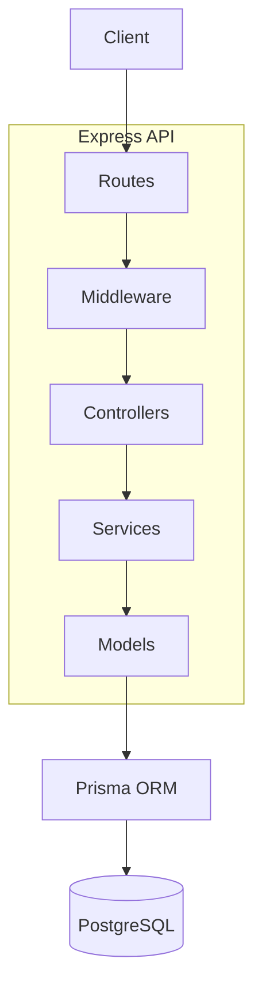

# Top Vino Backend

A spaced repetition learning/flashcard application backend built with Node.js, Express, TypeScript, and Prisma.

## 📚 Documentation

- [Domain glossary](./docs/CONTEXT.md) — the ubiquitous language for decks, cards, access, and study
- [Architecture decision records](./docs/adr/) — settled decisions; append-only
- [Testing guide](./docs/TESTING.md) — how to run tests and how the test database setup works
- [Logging contract](./docs/logging.md) — levels, redaction, correlation, failure events
- [Agent docs](./docs/agents/) — issue tracker, triage labels, domain doc conventions

## 🚀 Quick Start

```bash
# Install dependencies
npm install

# Start development server with Docker
docker-compose up

# Or run locally (requires PostgreSQL)
npm run dev

# Run the test suite (PostgreSQL must be running)
npm test
```

Copy `.env.example` to `.env` and fill in the required values before starting.

## 📋 Current Status

**Phases 1–5 complete. Deck Access refactor delivered. 206 tests passing.**

### Completed ✅

- Centralized error handling with Prisma and Zod validation support
- Deck, Card, and Review CRUD as TDD vertical slices with SM-2 spaced repetition scheduling
- Authentication via Better Auth (email/password + Google OAuth), cookie sessions with `subscriptionType` exposed for FREE/PRO gating
- Authorization middleware: `authMiddleware`, `requireOwnership`, `requireSubscription`
- Centralized Deck Access module (`deckAccess.service.ts`) — every deck/card load names a Requestor and an Action; collection queries compose a visibility scope. Covers owner, editor/viewer collaborators, and public decks
- Production hardening: env validation on startup, helmet, rate limiting, request size limits
- Structured logging via pino with redaction and request correlation (`/health` and `/ready` endpoints included)
- Graceful shutdown on SIGTERM/SIGINT
- Jest + Supertest harness against a dedicated test database; coverage runs reliably green

### Next Up 📌

- Minimal CI workflow: lint + typecheck + tests on every PR
- API contract documentation (OpenAPI or equivalent) ahead of frontend work
- Frontend application

## 🗺️ Roadmap — Phase 6: Deployment (not started)

Two options; pick one when ready. Continuous integration is independent of this choice and should land first.

### Option A: Simple deployment (1–2 days)

- PM2 process manager in cluster mode (`ecosystem.config.js`)
- Deploy to a VPS (Digital Ocean, Linode, AWS EC2)
- Nginx reverse proxy + Let's Encrypt SSL
- PostgreSQL on the same server or managed

### Option B: Cloud native (1–2 weeks)

- AWS: ECS/Fargate, RDS, ALB, CloudWatch, Secrets Manager, auto scaling
- Or a PaaS: Render, Railway, Fly.io
- Infrastructure as code (Terraform / AWS CDK)
- CD pipeline: automated deploy on merge to main, blue-green deployments

Deferred features (from earlier phases): Apple OAuth, MFA, passkeys, admin roles, AI grading/generation, FSRS evolution of the SM-2 scheduler.

## 🏗️ Backend Architecture



### Project structure

```
src/
├── app.ts                  # Express app config — Better Auth mounted before express.json()
├── server.ts               # Entry point with graceful shutdown
├── config/                 # Rate limiter configuration
├── lib/                    # Better Auth config, pino logger, Prisma client
├── middlewares/            # authMiddleware, requireOwnership, requireSubscription,
│                           # errorHandler, validationMiddleware
├── model/                  # Data-access layer (users, deck, card, review)
├── routes/                 # Controllers & routers per feature (user, deck, card, review)
├── services/               # Business logic incl. deckAccess.service.ts and SM-2 scheduler
├── types/                  # Express request augmentation
└── utils/                  # AppError hierarchy, Zod schemas, catchAsync, env validation
```

### Layer responsibilities

- **Routes/controllers**: map HTTP requests to service calls and return responses.
- **Middlewares**: session resolution, validation, security headers, rate limiting, structured request logging, centralized error formatting.
- **Services**: enforce business rules. Deck Access resolves ownership, collaborator role, and public visibility into a single answer; cards and reviews inherit their access from their deck.
- **Models**: isolate Prisma data-access operations.
- **Request lifecycle**: Client → Route → Middleware → Controller → Service → Model → Prisma → PostgreSQL. Errors flow through the global error handler into a consistent `{ success, status, statusCode, message }` shape.
